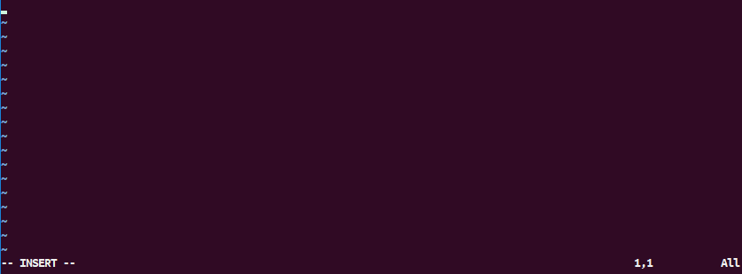

# Working in a linux environment

## Connecting to a remote linux computer

This section will cover how to connect to a remote linux computer via password or ssh keys.

To do you actual work you first need to connect on a remote server. If your current computer is running
Windows thus can be done by using [PuTTY](https://www.putty.org/), however I strongly encourage to 
get [WSL](https://docs.microsoft.com/en-us/windows/wsl/install-win10) This way you can enjoy a 
Ubuntu-like terminal on you Windows machine. This means the following instructions are relevant for both
Windons on WSL and linux users.

Things to know when connecting to a server:

1. Getting a linux account. Ask you administrator to create an account with a username of your choosing. 
Keep in mind you will need the username to login and access your files. Keep it short, simple and
alphanumeric.

2. Method of authentification. There are main two methods: passwords and ssh-keys. 

If you are using *passwords* you will be issued a password by your administrator - change it on your first login by typing in
`passwd' and following the prompt. 

If the system uses authentication by *ssh keys* you should first generate a public private key pair.
This can be done by typing `ssh-keygen -t rsa -C "you@host.com"` in you terminal. The `"you@host.com` 
can be anything - it is used to distinguish keys - you may have multiple of them. You can use your work 
email, full name or other identifiable text.

Go to your `~/.ssh` directory. You should see two recently created files: `id_rsa` and `id_rsa.pub`. 
These files are you ssh key pair. The `id_rsa` is the private key - you should never send it to 
anyone - by having this key anyone is able to connect to a computer which has authorization to connect
with this key. On the other hand `id_rsa.pub` should be sent to you administrator who will put it in 
`~/.ssh/authorised_keys` file on the remote computer this will enable you to connect to the machine.

3. Connecting. It should be as simple as typing in the command: `ssh username@remote_computer_ip`.
If you are using passwords you will be prompted for it. If everything went smooth you will be welcomed
in the remote server.

4. Ease of use. You might find yourself in a situation where you have multiple keys and/or connecting to
multiple machines. In this case it is very handy to use a config file in `~/.ssh` directory. Simply
create a text file with the following lines:

```
Host your_alias
HostName remote_computer_ip
User your_username
Port connection_port
IdentityFile path_to_private_key 
```

path_to_private_key will be `~/.ssh/id_rsa` in our case. This file holds all the connection 
information about to the remote computer. You can now use it's alias to connect to it e.g.
`ssh your_alias` Very handy!

## Basic terminal commands 

This section will introduce the main commands you will need in your daily routine. I will use some 
Windows analogies to illustrate how they can be used. Note that you should be careful when not only 
deleting files, but also writing because your work can be overwritten.

### Navigating the folders

After connecting to the remote computer you should land in your home folder. The terminal shows where you
are currently you shloud see a `~$` before your blinking cursor. Type `pwd` for print working directory
you should see `/home/your_username` printed after the command is executed. This is your home folder.

To know what's in a folder type `ls` (for list). It might be empty and nothing will get printed. We
can go *up* one directory level to `/home` directory to check it out. Type `cd ..` in the command 
prompt to do so. It is equivalant to Alt + ↑ or clicking the up arrow in the Windows File 
Explorer navigation bar.

Type `ls` once more to see what's inside this folder. You should see a list of folders with named after
usernames of this computer's users. If there are many users the printing might seem cluttered and hard to read.
Try typing `ls -l` this outputs a much nicer table like output with folder names in the last column.
the `-l` after the `ls` command is a argument (sometimes also called a flag) it lists out the contents of 
the folder in a Long File Format. Try googling for other arguments of the `ls` function - you will
be using it a lot - so it's good to know what your options are.

Last thing to note that you navigate to folder by absolute path like `cd /home/your_username/` and
by relative path `cd your_username`.

### Creating and folders and files, part 1

I'm assuming you returned to your folder `/home/your_username/` and are ready to make some folder i.e.
directories. Conveniently this command is named `makedir`. Let's type out `makedir new_folder` to create
a folder by that name and lets go inside it. 

When creating files you have more options of commands. If you want create a short text file you can use
`>` and `>>` commands. Let's type `echo "This is some text" > new_file.txt` and then `ls` to check 
if our file exists. Ok let's break down what happens when you type the `echo ...` command. 
The `echo` command writes the passed arguments (in out case the string *This is some text*) 
to standard output (often shortened to *stdout*). Is one of the three standard streams of I/O the others
being stardard input (stdin) and standard error (stderr). These streams are plain text that can be
easily written or displayed. You have already passed command to standard input when typing and 
executing commands in the interactive shell. You have also seen stdout in action when you invoked `ls` 
commands. However, stdin and stdout should not be associated with terminal prompt and output (which 
are inded the default options) they can be any file or even device and the standard streams can be 
redirected as we will se below. Tthis explanation was longwinded but it will come in hand when 
explaining the command.

The command `echo` writes the string "This is some text" to standard input. Let's try the command 
`echo "This is some text"` you should see your terminal outputting *This is some text*. This was to
be expected, right? Now the arrow `>` is used to redirect the standard output to somewhere else in this 
case it's the file new_file.txt.

### Viewing file contents (part 1)

Now to see what's inside the file you also have several options here:

- cat new_file.txt (cat is used to con**cat**tenate several files and then print to stdout but in 
this case it is very useful to print single files)
- less new_file.txt to read the file page by page
- more new_file.txt to view the entire file's contents

### Creating folders and files, part 2 (VIM)

I mentioned there are several option to create files. I think you can already see the limitations of 
first approach, however let's explore a few more thing before moving on to text editors. 

It is important to know that `>` will override any file try it with echo 
`echo "This is some completely new text" > new_file.txt` further limiting it's usage. Thankfully, there is 
a similar function `>>` that will keep adding lines to the end of the file leaving rest of it's contents 
intact: `echo "This is a new line" >> new_file.txt`. It comes very handing when collecting outputs from some
running program.

If have ever used a text editor like MS Word or LibreOffice Writer you should know powerful and easy
to use they are. The text editors discussed below are as powerful, however have steeper learning curve.
The reason you should have at least a basic command of at least one of them is often you will have no 
other options to edit files on remote computers. 

Let's discuss VIM first. Why VIM? It's quite popular according to a recent Stack Overflow [survey](https://insights.stackoverflow.com/survey/2019#development-environments-and-tools) and
it might be available in your linux environment.

To start editing a file young VIM just type `vim new_vim_file.txt`. If it's a new file you should see
`"new_vim_file.txt" [New File]` in the bottom left. The behavior of VIM can altered by switching it's
modes, let's discuss the main modes briefly:

- Normal mode (also called Command mode) this is mode you can execute commands in VIM. This is the 
default mode when you open a file
- Insert mode used to alter the file's contents insert/write text
- Visual mode lets you to select text like you would with a mouse

Let's go through a simple task in VIM: writing a line of text and saving the document. Assuming you 
kept the file open press `a` or `i` key to go to insert mode. It should look something like this:



You can type as normally now. Write something in like: This is a new line written in VIM. Now 'save' 
the file. First you need return to to Command mode by hitting **Esc** key 
(you should see the -- INSERT -- vanish from the bottom left), now press `:` key and type w. 
The prompt should look like this:


Now press enter to execute the command. You should get a message `"new_vim_file.txt" 1L, 35C written` 
mean you have just written 1L containing 35 characters. Now to quit the VIM program press `:` 
and type q, press enter to execute the command (you could also could have gone with `:wq` to
write-and-quit in one go). If for some reason you don't want to save the changes use `:q!` to quit 
without saving.

There's a pretty high change you'll be navigating far larger text files that the one we've just created.
The following commands will help you navigating:

- h moves the cursor one character to the left.
- l moves the cursor one character to the right.
- j moves the cursor down one line.
- k moves the cursor up one line.
- 0 moves the cursor to the beginning of the line.
- $ moves the cursor to the end of the line.
- w move forward one word.
- b move backward one word.
- G move to the end of the file.
- gg move to the beginning of the file.
`. move to the last edit.

A little explanation is needed on the `hjkl` you have probably already noticed that it's possible to 
achieve the same navigation with arrow case and as a bonus it also works in insert mode. As with many
trivialities in Computer Science world there is an ongoing discussion whether the `hjkl` or they arrow keys 
should be used. In fact the arrow keys are superior to the `hjkl` because the can be used in conjunction with
Ctrl to jump across individual words. You don't have to use them because someone told you so without 
justifying the motivation. 

VIM has a lot of keyboard-shortcuts and they will discussed here you can look at or even print out 
**cheatsheets** like [this](https://vim.rtorr.com/) to practise using them. I suggest looking at 
*Cut and paste* and *Search and replace* sections first. VIM does not have the most intuitive if UIs and 
takes some time to master. Try learning it bit by bit and testing out new things in a toy environment.

### Deleting files and folders

To delete a file simply use the `rm` command followed with the file name like `rm new_vim_file.txt`.
Be careful when deleting files - the action is irreversible It is smart to select the files first 
before deleting them to make sure you are deleting you want to delete. This is especially important 
when deleting multiple files. First let's learn how to make multiple files. We will use `touch` command
along with the brace expansion `touch file{1..10}.txt`. `touch` can create empty files, but it is
usually used to modify the timestamp of a file. Let's look at the folder - you should see ten new files
named `file1.txt` to `file10.txt`. Let's say what we like the file `file10.txt` but want to delete 
the others. We could do the `rm` operation 9 times on each individual file, but it wouldn't be a 
good use of out time would it? We can optimize the procedure by using wildcards. If you are familiar 
with regex you should know what `*` and `?` stand for. If not `*` - match any symbol(s) i.e. one 
or more and `?` will match a single any symbol. Let's try them out by listing our files: 
`ls file*.txt` should output all the file names we have created, It is very natural because the `*`
(we can refer to it as **glob**) matches the first number for the files `file1.txt` to `file9.txt`
and it also matches the 0 for `file10.txt`. But what if we used the question mark? `ls file?.txt`
should show you only files `file1.txt` to `file9.txt` because it match a character a single time.
We know know how deletion will work and we're not afraid to use it let's do `rm file*.txt`. You can see
the file `file10.txt` is the only one left. You could point that it was very convinient for us to leave 
the double digit file, but there are other matching capabilities, say we needed to delete files 
`file6.txt` to `file10.txt` we could have used the same brace expansion: `rm file{6..10}.txt` to delete them.

Deleting folder is not that different, just remember that **all** of their contents will be deleted 
along, we just have to pass along a `-r` flag to delete them: `rm -r my_folder`.

### Copying, moving files and folder

Copying is achieved with `cp` command and the following syntax `cp my_file_location the_copy_file_location`
You can also copy multiple files just make sure to include the wildcards for both file groups.

Moving a file can be done with `mv`: `mv file_to_move new_location_of_file`. This command is also used for renaming files.

Copying/moving folders is not different.

Finally, you will often want to transfer between computers then you should use `scp`. The following 
will let you copy files from the remote machine to yours while you are on the local machine:
`scp remote_username@remote.ip.adderess:/remote/path/to/file.txt /home/local_username/file.txt`
reverse the two arguments to copy from your local machine to remote. The syntax will work
if you are on remote computer just be aware what machine you are operating.

We are done with basic linux commands and will introduce some new ones later. You should have a 
good grasp of creating/deleting/editing/moving/copying files and folders.

